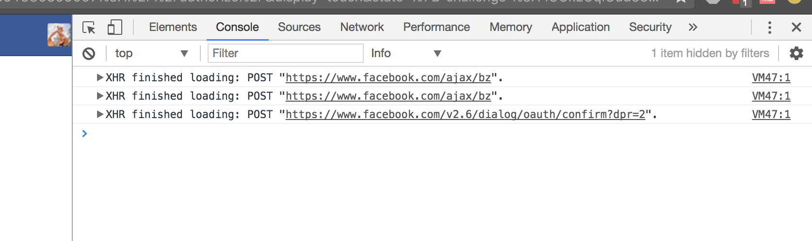
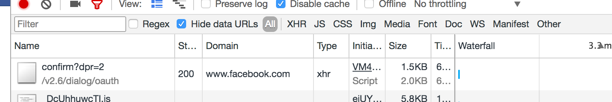
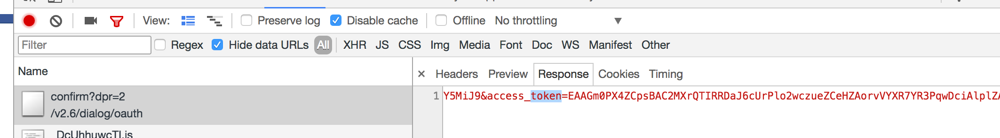
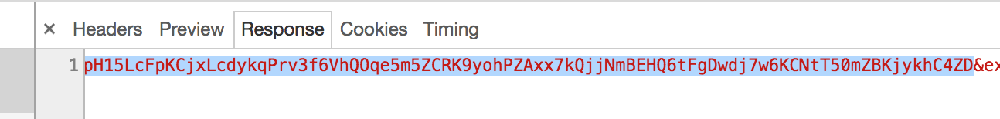
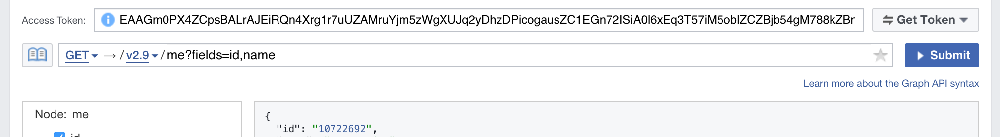

# Step 1 - Get Facebook Auth Token

* Go to this url [Auth URL](https://www.facebook.com/v2.6/dialog/oauth?redirect_uri=fb464891386855067%3A%2F%2Fauthorize%2F&display=touch&state=%7B%22challenge%22%3A%22IUUkEUqIGud332lfu%252BMJhxL4Wlc%253D%22%2C%220_auth_logger_id%22%3A%2230F06532-A1B9-4B10-BB28-B29956C71AB1%22%2C%22com.facebook.sdk_client_state%22%3Atrue%2C%223_method%22%3A%22sfvc_auth%22%7D&scope=user_birthday%2Cuser_photos%2Cuser_education_history%2Cemail%2Cuser_relationship_details%2Cuser_friends%2Cuser_work_history%2Cuser_likes&response_type=token%2Csigned_request&default_audience=friends&return_scopes=true&auth_type=rerequest&client_id=464891386855067&ret=login&sdk=ios&logger_id=30F06532-A1B9-4B10-BB28-B29956C71AB1&ext=1496455266&hash=Aebb6BYzc11KrEzS)
* Authenticate with your Facebook credentials.
* Open up the Chrome debugger - (cmd + opt + j)
* Click "Ok" on the Facebook modal prompt
* Find the url like below. "../dialog/oauth/confirm...":



* Double click on the token itself and save it. Save it. It should be a really long string. Over ~250 characters.


# Step 2 - Get Facebook ID

* Go this url [Graph API Explorer](https://developers.facebook.com/tools/explorer/)
* Enter in the auth token you just saved.
* Click submit

* Save the ID. Ex. "10722692"

# Step 3 - Export Chats

Open up your terminal

* Clone the repo and cd into the folder

```
git clone https://github.com/guymorita/tinpull.git
cd tinpull
```

* Run npm and run the file

```
npm install
node tinpull.js
```

* Follow the prompts by pasting and entering the Facebook Auth Token and ID
* The script will output a file called "export.json" in the same directory.
* Send it over
